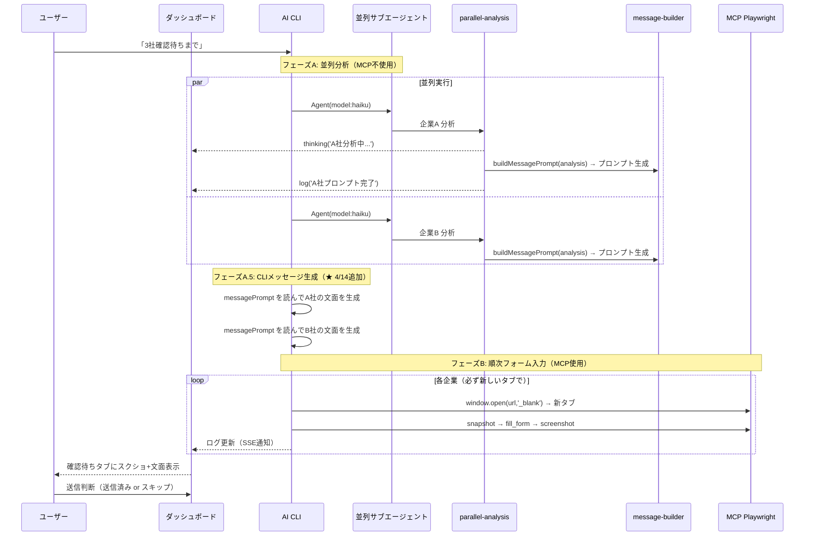

# Sales Claw プロジェクト詳細分析レポート

> **対象**: `C:\bp-outreach` (sales-claw v1.0.9+)
> **初回分析日**: 2026-04-03
> **最終更新日**: 2026-04-14 (第5版改訂)
> **注意**: 本レポートは未コミットの作業ツリーに基づく分析メモです。Git上の固定版とは異なる場合があります。
> **ライセンス**: MIT

---

## 1. プロジェクト概要

**Sales Claw** は、B2B企業の問い合わせフォーム経由での営業アプローチを自動化するデスクトップツールです。

Claude Code CLI / Codex CLI / Gemini CLI（マルチAIプロバイダー対応）と Playwright（ブラウザ自動化）を組み合わせ、以下の一連のワークフローを半自動化します：

```
ターゲット企業選定 → 企業サイト分析 → カスタムメッセージ生成 → フォーム自動入力 → 人間による確認・送信判断
```

> [!IMPORTANT]
> **既定では送信前に人間の承認が必須**（Human-in-the-loop）。ただし `autoSendEligibleForms: true` を設定すると、CAPTCHA・手動確認・営業NGが検出されない安全なフォームについては自動送信が可能。CAPTCHA付き・判断が難しいフォームは設定に関わらず確認待ちで停止する。

---

## 2. アーキテクチャ

```mermaid
graph TD
    A["AI CLI<br/>(Claude/Codex/Gemini)"] -->|分析指示| B["company-analyzer.cjs<br/>企業サイト分析"]
    A -->|メッセージ生成プロンプト| C["message-builder.cjs<br/>CLIプロンプト生成"]
    A -->|フォーム操作| D["MCP Playwright<br/>ブラウザ自動化"]

    B --> E["Playwright / HTTP<br/>Webクローリング"]
    D --> F["問い合わせフォーム<br/>自動入力"]

    G["Electron App<br/>デスクトップアプリ"] --> H["dashboard-server.cjs<br/>ダッシュボードサーバー"]
    H --> I["ブラウザUI<br/>ダッシュボード"]

    H -.->|SSE/WebSocket| I
    H -->|設定管理| J["settings-manager.cjs<br/>Single Source of Truth"]
    H -->|ログ管理| K["action-logger.cjs<br/>ファイルロック+アトミックライト"]
    H -->|履歴管理| L["contact-history.cjs"]
    H -->|進行状況| M["live-monitor.cjs<br/>ファイルロック+アトミックライト"]
    H -->|AI切替| N["ai-providers.cjs<br/>マルチプロバイダー管理"]

    O["parallel-analysis.cjs<br/>並列分析エンジン"] -->|HTTP分析| B
    O -->|プロンプト生成| C
    O -->|ログ通知| P["cli-logger.cjs<br/>思考中インジケーター"]
    O -->|フォームURL解決| Q["form-url-resolver.cjs<br/>自律的フォームURL探索"]

    J -->|読み書き| R["data/settings.json"]
    K -->|読み書き(ロック付)| S["data/action-log.json"]
    M -->|読み書き(ロック付)| T["data/live-monitor.json"]
```

### 技術スタック

| 層 | テクノロジー | 用途 |
|----|------------|------|
| **デスクトップアプリ** | Electron v34.5 | ネイティブウィンドウ、システムトレイ常駐、自動更新 |
| **サーバー** | Node.js (http, ws) | ダッシュボードAPI、SSEリアルタイム通知、WebSocket PTY通信 |
| **ブラウザ自動化** | Playwright v1.58 (MCP) | 企業サイト巡回、フォーム入力、スクリーンショット撮影 |
| **AI** | Claude Code / Codex / Gemini CLI | 企業分析の統合判断、メッセージ文面の自然言語生成、ワークフロー制御 |
| **並列処理** | Node.js child_process + ファイルロック | 複数企業の同時分析（parallel-analysis.cjs） |
| **フォームURL探索** | form-url-resolver.cjs | SSRF安全な自律的フォームURL検出・解決 |
| **データ管理** | xlsx ライブラリ | Excel/CSVターゲットリストの読み書き |
| **UI** | Single-file HTML (インラインCSS/JS) | ダッシュボードUI（SPAライク、Chart.js統合） |
| **多言語** | カスタム i18n.cjs | 日本語/英語の完全対応 |

---

## 3. 機能詳細

### 3.1 企業サイト分析

#### フル分析 (`company-analyzer.cjs` — 165行)
Playwrightでターゲット企業のWebサイトを自動巡回し、以下の情報を構造化抽出：

| 分析項目 | 検出方法 |
|---------|---------|
| **事業領域** | 13カテゴリのキーワードマッチング |
| **ギャップ検出** | 自社の強み（settings定義）のキーワードがターゲットサイトに**ない**場合、補完提案のポイントとして検出 |
| **注力分野** | DX推進、AI活用、クラウド移行、新規事業、パートナー募集の5パターン |
| **協業パターン** | ターゲットの業種と合致する過去の協業実績を自動選択 |
| **サイト抜粋** | 生テキスト冒頭1,200文字（`siteTextExcerpt`）をメッセージ生成プロンプトに提供 ★ 4/14追加 |

#### 軽量分析 (`parallel-analysis.cjs` — 296行)
Playwright不使用のHTTPベース軽量分析。サブエージェントから並列実行可能：

- **HTTPフェッチ**: リダイレクト3回まで追跡、15秒ウォールクロックタイムアウト
- **SSRF防止**: プライベートIP（v4/v6）・10進数IP・16進数IP・ドットなしホスト名をブロック
- **レート制限対応**: HTTP 429/503 検知 → 指数バックオフ（2秒→4秒、最大3回リトライ）
- **メッセージ品質チェック**: 生成メッセージが50文字未満の場合、error扱い
- **サイト抜粋**: 取得テキスト冒頭1,200文字を `siteTextExcerpt` として保持 ★ 4/14追加
- **フォームURL自動解決**: `form-url-resolver.cjs` を呼び出し
- **ログ連携**: `thinking()` でリアルタイム進行状況表示

---

### 3.2 フォームURL自動探索 (`form-url-resolver.cjs` — 221行)

ターゲット企業の問い合わせフォームURLをSSRF安全に自律検出・解決するモジュール：

| 段階 | 方法 | 詳細 |
|------|------|------|
| **Stage 1: リンク抽出+スコアリング** | サイトHTML内のリンクを解析 | `問い合わせ/contact` → +100点、`form` → +60点、`recruit/ir/press` → -60点 |
| **Stage 2: 共通パス探索** | `/contact`, `/inquiry`, `/toiawase`, `/form` 等10+パスを探索 | HTMLシグネチャでフォーム検出 |

---

### 3.3 メッセージ生成 (`message-builder.cjs` — 526行) ★ 4/14大幅更新

#### 生成方式の変更（4/14〜）

旧方式（テンプレートベース）から、**CLIの言語能力を活用したパーソナライズ生成**に移行。

```
分析結果 + 設定
  ↓ buildMessagePrompt(analysis)
  CLIプロンプト（構造化コンテキスト）
  ↓ CLI エージェントが生成
  企業ごとのパーソナライズ文面
```

#### 関数一覧

| 関数 | 説明 |
|------|------|
| `buildMessagePrompt(analysis)` | **★ NEW** CLI用プロンプトを生成。`approachObjective`/`approachGuardrails`/サイト抜粋/ギャップ分析を含む構造化コンテキストを返す |
| `buildCustomMessage(analysis)` | テンプレートベース生成（フォールバック用） |
| `buildMessage(companyName, companyType)` | 業種別プロフィールベースの定型文 |

#### `buildMessagePrompt` が含む情報
- 送信先: 企業名・種別・事業領域・注力分野・ギャップ・サイト抜粋（600文字）
- 送信元: 自社名・担当者・強み・協業実績
- 方針: `approachObjective`（営業方針）、`approachGuardrails`（禁止事項）、トーン、文字数上限
- 文面構成: 挨拶・締め・CTA・参照URL・署名
- 品質基準: テンプレート感排除・尖った強み1-2個・Win-Win匂わせ等

#### セキュリティ
- サイト抜粋からBidi文字・制御文字をサニタイズして挿入（prompt injection対策）

---

### 3.4 フォーム探索・検証

#### フォーム探索の優先順位
1. **問い合わせURLが既知**: そのURLを直接使用
2. **form-url-resolver.cjs で自動解決**: 2段階アルゴリズムでフォームURL検出
3. **未登録の場合**: Google検索「会社名 問い合わせ」の公式ドメイン最上位結果を使用

#### フォーム検証 (`form-validator.cjs` — 220行)
| 判定パターン | 対応 |
|------------|------|
| HTMLフォーム（2フィールド以上） | ✅ 有効 |
| iframe埋め込みフォーム（HubSpot, formrun等） | ✅ 有効 |
| 「営業お断り」記載あり | ❌ 除外（skippedログ） |
| 振り分けページ | 🔄 リダイレクト先を提示 |
| メールアドレスのみ | ❌ Webフォームなし |

---

### 3.5 ダッシュボード (`dashboard-server.cjs` — 10,669行+)

#### UIタブ構成

| タブ | 機能 |
|------|------|
| **企業一覧** | フィルタリング、種別・進捗セレクト、検索、行クリックで詳細モーダル、追加・編集・削除、Excel/CSVインポート、一括操作 |
| **確認待ち** | フォーム入力スクリーンショット表示、文面確認、「送信済み」「スキップ」判断、一括承認 |
| **送信済み** | 送信履歴、連絡回数、送信日時、返信状況 |
| **CLI Activity** | リアルタイムログストリーム、xterm.jsターミナル、アクションログテーブル |
| **設定** | 6セクション設定フォーム、セットアップガイド、Excel一括入出力 |

#### APIエンドポイント（主要）

| メソッド | パス | 機能 |
|---------|------|------|
| GET | `/api/data` | 企業一覧 + 統計（キャッシュ付き） |
| GET/PUT | `/api/settings/:section` | 設定取得・更新（監査ログ付き） |
| POST | `/api/ai-form-fill` | AIフォーム入力開始（重複防止+2回目判定） |
| POST | `/api/approve` | 承認/スキップ（スクショ存在検証付き） |
| GET | `/events` | SSEストリーム |
| WebSocket | `/terminal` | AI PTYターミナル |

---

### 3.6 マルチAIプロバイダー (`ai-providers.cjs` — 238行)

| プロバイダー | CLI名 | デフォルトモデル |
|------------|-------|---------------|
| **Claude** | `claude` | claude-sonnet-4-6 |
| **Codex** | `codex` | — |
| **Gemini** | `gemini` | — |

---

### 3.7 2フェーズ並列処理パイプライン ★ 4/14更新（フェーズA.5追加）

```
フェーズA（並列）: N社同時分析 + メッセージ生成プロンプト構築（MCP不使用、HTTPベース）
    ↓ 全社完了まで待機
フェーズA.5（順次）: CLIがプロンプトを読んで企業ごとにパーソナライズ文面を生成
    ↓ メッセージ確定
フェーズB（順次）: 成功した企業のみ1社ずつフォーム入力（MCP Playwright使用）
```

| フェーズ | 処理 | MCP | 並列 | 主体 |
|---------|------|-----|------|------|
| **A** | サイト分析 + プロンプト構築 + フォームURL解決 | 不使用 | ✅ N社同時 | バックエンド（Node.js） |
| **A.5** | パーソナライズ文面生成 | 不使用 | — | **CLI エージェント** |
| **B** | フォーム入力 + スクショ | Playwright | ❌ 1社ずつ | **AI managed セッション** |

**効果**: 3社で9分→4分（55%短縮）。Phase A.5 導入で文面品質が大幅向上。

#### フェーズA 出力フォーマット（4/14〜）

```json
{
  "ok": true,
  "no": 1,
  "companyName": "〇〇株式会社",
  "analysis": { "businessAreas": [], "gaps": [], "focusAreas": [], "siteTextExcerpt": "..." },
  "messagePrompt": "以下の情報をもとに...",
  "templateDraft": "お世話になります...",
  "message": "（templateDraftと同値、後方互換）",
  "formUrl": "https://...",
  "formResolutionMethod": "resolved"
}
```

---

### 3.8 重複キューイング防止 + フォローアップ判定

- `/api/ai-form-fill` でアクティブセッションを確認、処理中企業は409で拒否
- 2回目以降は `contactNo` をプロンプトに付与し「前回とは異なる切り口」でメッセージ生成

---

### 3.9 AIクラッシュ時の自動リカバリー

PTY `onExit` ハンドラーで未完了企業を自動error化。クラッシュ後も放置されない。

---

### 3.10 「思考中」インジケーター (`cli-logger.cjs` — 46行)

```javascript
const { thinking, log } = require('./src/cli-logger.cjs');
thinking('株式会社〇〇のサイトを分析中...');  // ダッシュボードにスピナー表示
log('分析完了', 'action');                     // スピナーが消えてログに追加
```

---

### 3.11 データ整合性保護

- **ファイルロック**: `acquireFileLock()` で排他的作成（PIDベース、5秒タイムアウト）
- **アトミックライト**: `.tmp` → `rename` + Windows EPERM フォールバック

---

### 3.12 承認フロー制御 (`approval-artifacts.cjs` — 480行)

| 監査状態 | 条件 | 操作 |
|---------|------|------|
| `confirm` | 入力 + 確認画面スクショあり | ✅ 承認可能 |
| `input-only` | 入力スクショのみ | ⚠️ 条件付き承認 |
| `missing` | スクショなし | ❌ 承認不可（409） |

---

### 3.13 設定管理 (`settings-manager.cjs` — 514行)

| セクション | 内容 |
|-----------|------|
| **companyProfile** | 自社情報（会社名、担当者名、メール、電話等） |
| **valuePropositions** | 自社の強み、協業実績パターン、業種別プロフィール |
| **targetList** | ファイルパス、ファイル形式、カラムマッピング |
| **exclusionRules** | 競合、既存顧客、NGリスト |
| **messageTemplates** | トーン、挨拶文、`approachObjective`（営業方針）、`approachGuardrails`（禁止事項）、署名 |
| **preferences** | ポート、言語、AIプロバイダー・モデル設定等 |

---

## 4. データフロー（4/14版）



---

## 5. セキュリティ設計

| 項目 | 対策 | 実装箇所 |
|------|------|---------|
| **データ保護** | `settings.json` は `.gitignore` で除外 | — |
| **CSRF防止** | Origin/Referer/Sec-Fetch-Site 3重検証 | `isAllowedOrigin()` |
| **XSS防止** | `esc()` で5文字エスケープ + DOM API統一 | `esc()`, `appendCliLog()` |
| **SSRF防止** | プライベートIP全パターンブロック + リダイレクト再検証 | `isSafeUrl()` |
| **Prompt Injection防止** | サイト抜粋からBidi/制御文字をサニタイズ ★ 4/14追加 | `buildMessagePrompt()` |
| **DoS防止** | `/api/cli-log` 64KB制限 + 4000文字切り詰め | dashboard-server.cjs |
| **送信承認** | スクショ存在物理検証 | `assertApprovalArtifacts()` |
| **ファイルロック** | 並列書込み競合防止 | `acquireFileLock()` |
| **重複キュー防止** | 処理中企業の再キューイングを409で拒否 | `/api/ai-form-fill` |

---

## 6. ファイル構成サマリー

> **行数は 2026-04-14 時点の実測値。**

```
sales-claw/
├── electron-main.js            (455行)
├── DESIGN.md                   (341行)   UIデザインシステム
├── src/
│   ├── dashboard-server.cjs    (10,669行+) ダッシュボードサーバー + UI全体
│   ├── i18n.cjs                (1,003行)  多言語辞書
│   ├── target-list.cjs         (651行)    ターゲットリスト管理
│   ├── settings-manager.cjs    (514行)    設定管理 (SSOT)
│   ├── approval-artifacts.cjs  (480行)    承認フロー制御
│   ├── settings-excel.cjs      (436行)    Excel一括設定
│   ├── message-builder.cjs     (526行)    ★ 4/14更新 CLIプロンプト生成追加
│   ├── live-monitor.cjs        (355行)    進行状況モニター
│   ├── parallel-analysis.cjs   (296行)    ★ 4/14更新 siteTextExcerpt/messagePrompt追加
│   ├── contact-history.cjs     (259行)    連絡履歴管理
│   ├── ai-providers.cjs        (238行)    マルチAIプロバイダー管理
│   ├── form-url-resolver.cjs   (221行)    フォームURL自律探索
│   ├── form-validator.cjs      (220行)    フォーム検証
│   ├── email-fetcher.cjs       (196行)    Outlookメール取得
│   ├── action-logger.cjs       (196行)    操作ログ
│   ├── company-analyzer.cjs    (165行)    ★ 4/14更新 siteTextExcerpt追加
│   ├── form-finder.cjs         (139行)    フォームURL探索（旧方式）
│   ├── dashboard-runtime.cjs   (128行)    ランタイム情報管理
│   ├── outreach-targets.cjs    (72行)     営業対象リスト管理
│   ├── form-helpers.cjs        (65行)     フォーム操作ヘルパー
│   ├── cli-logger.cjs          (46行)     CLIログ + 思考中インジケーター
│   ├── data-paths.cjs          (35行)     データパス解決
│   ├── port-utils.cjs          (32行)     ポート空き検出
│   └── config.cjs              (13行)     設定インターフェース
├── data/
│   ├── settings.json           (実設定、gitignore)
│   ├── sample-settings.json
│   ├── action-log.json
│   ├── contact-history.json
│   ├── live-monitor.json
│   └── ai-run-metrics.jsonl    (AI実行メトリクス)
├── screenshots/
├── docs/
│   ├── project_analysis_report.md  (本ファイル)
│   ├── form-fill-rules-and-settings-audit.md
│   ├── oss-readiness-review-2026-04-01.md
│   └── release-notes-v1.0.9.md
└── dist/win-unpacked/          (ビルド成果物 — src変更時は手動コピー要)
```

**総コード行数**: 約 **17,700行+**

---

## 7. OMC モデルルーティング（推奨）

| 処理 | モデル | コスト比 | 備考 |
|------|--------|---------|------|
| 企業サイト分析（並列） | Haiku | 1/10 | parallel-analysis.cjs |
| フォーム探索・検証 | Haiku | 1/10 | form-url-resolver.cjs |
| メッセージ生成（A.5） | Sonnet | 1/5 | CLI言語能力を活用 |
| フォーム入力 + スクショ | Sonnet | 1/5 | MCP Playwright |
| エラー対応・デバッグ | Opus | 1x | 低頻度のみ |

**3社アプローチ時**: 全Opus比で **約75%のコスト削減**。

---

## 8. 依存パッケージ

| パッケージ | バージョン | 用途 |
|-----------|----------|------|
| `electron` | ^34.5.8 | デスクトップアプリ |
| `electron-builder` | ^25.1.8 | ビルド・パッケージング |
| `electron-updater` | ^6.8.3 | 自動更新 |
| `node-pty` | ^1.1.0 | PTYターミナル |
| `playwright` | ^1.58.2 | ブラウザ自動化 |
| `ws` | ^8.20.0 | WebSocket通信 |
| `xlsx` | ^0.18.5 | Excel/CSV読み書き |

---

## 9. 運用ワークフロー

### 初回セットアップ
1. AI CLI をインストール（Claude / Codex / Gemini のいずれか）
2. Playwright Chromium をインストール（`npx playwright install chromium`）
3. `data/settings.json` に自社情報を入力（Settings タブのガイドで完了状況確認）
4. ターゲットリスト（Excel/CSV）を準備・設定
5. `messageTemplates.approachObjective` と `approachGuardrails` を設定（メッセージ品質に直結）

### 日常運用
1. `npm start` でアプリ起動
2. AI CLI に指示：`「3社確認待ちまで進めて」`
3. フェーズA（並列分析）→ A.5（CLIメッセージ生成）→ フェーズB（フォーム入力）が自動実行
4. 確認待ちタブでスクショ・文面を確認して送信判断
5. 2回目アプローチ時は同じ企業を再キュー → フォローアップメッセージが自動生成

---

## 10. 品質保証 — 実施済みレビュー履歴

| ラウンド | エージェント | 検出 | 結果 |
|---------|------------|------|------|
| 1〜8 | code-reviewer + security-reviewer | CRITICAL 5 + HIGH 17 | 全修正（〜4/6） |
| 9 | code-reviewer（4/14） | HIGH 2 + MEDIUM 2 | 全修正（4/14） |

#### 4/14 レビューで修正した項目
| 重要度 | 内容 |
|--------|------|
| HIGH | タイムアウト時分析オブジェクトに `siteTextExcerpt`/`companyUrl` が欠落 |
| MEDIUM | `company-analyzer.cjs` でテキスト結合が2重（rawJoinedText変数で統一） |
| MEDIUM | サイト抜粋のプロンプト注入対策（Bidi/制御文字サニタイズ） |

---

## 11. 残存する改善候補

### MEDIUM
| # | 問題 | 推奨対策 |
|---|------|---------|
| 1 | `dashboard-server.cjs` が単一ファイル肥大 | HTML/CSS/JSをテンプレートファイルに分離 |
| 2 | `settings-manager.cjs` のwriteがアトミックでない | .tmp→rename パターンを適用 |
| 3 | テストコードなし | message-builder, action-logger, parallel-analysis のユニットテスト |
| 4 | `/api/cli-log` にshared secretなし | 起動時ランダムトークン + 環境変数渡し |

### LOW
| # | 問題 | 推奨対策 |
|---|------|---------|
| 5 | キーボードショートカットなし | Ctrl+1〜5でタブ切替 |
| 6 | ダークモードなし | CSS変数ベースのダークモード |

---

## 12. 更新サマリー（バージョン別）

| バージョン | 機能 | 状態 |
|----------|------|------|
| v1.0.9 | フォームURL自律解決、マルチAIプロバイダー、並列処理、アナリティクスパネル、自動更新 | リリース済み |
| **4/14更新** | CLIベースパーソナライズメッセージ生成（buildMessagePrompt）、siteTextExcerpt、フェーズA.5、prompt injection対策 | 実装済み |

---

## 13. エージェントオーケストレーション

| 担当 | エージェント | 対象 |
|------|------------|------|
| フロントエンド・UI設計・統合 | **Claude** | HTML/CSS/i18n/ダッシュボードUI |
| バックエンド実装 | **CODEX** | .cjs サーバーロジック・データ処理 |

---

## 14. 変更履歴

| 日付 | 版 | 主な変更 |
|------|-----|---------|
| 2026-04-03 | 初版 | プロジェクト構造・機能の初回分析 |
| 2026-04-05 | v2 | マルチAI対応、並列処理、思考中UI、セキュリティ強化 |
| 2026-04-05 | v3 | 第三者監査8ラウンド完了。CRITICAL 5 + HIGH 17件修正 |
| 2026-04-06 | v4 | form-url-resolver.cjs新規、統合アナリティクス刷新、Phase A バックエンド化、トークン最適化、DESIGN.md |
| 2026-04-14 | **v5** | CLIベースメッセージ生成（buildMessagePrompt/Phase A.5）、siteTextExcerpt、prompt injection対策、code-reviewer自動起動ルール最適化（5ファイル以上のみ）、リダイレクトスタブ8件削除 |
